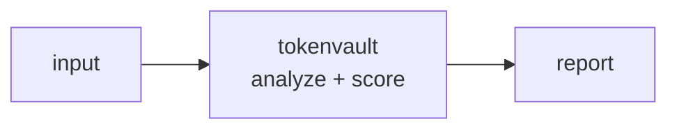

<a name="top"></a>
<div align="center">


# TOKENVAULT

### Self-hostable PCI tokenization microservice and CLI that swaps PANs for format-preserving tokens and proves no raw card data persists.


[](https://pypi.org/project/cognis-tokenvault/) [](https://github.com/cognis-digital/tokenvault/actions) [](LICENSE) [](https://github.com/cognis-digital)

*Fintech & Payments Security — PCI, fraud, AML, and payment rails.*

</div>

```bash
pip install cognis-tokenvault
tokenvault scan .            # → prioritized findings in seconds
```


<!-- cognis:example:start -->
## 🔎 Example output

Real, reproducible output from the tool — runs offline:

```console
$ tokenvault-emit --version
tokenvault 0.1.0
```

```console
$ tokenvault-emit --help
usage: tokenvault [-h] [--version] [--format {table,json}] <command> ...

PCI tokenization CLI: swap PANs for format-preserving tokens with an access audit trail.

positional arguments:
  <command>
    scan                detect PANs in a file (CI gate)
    tokenize            replace PANs with tokens
    detokenize          reverse a token back to its PAN
    audit               show the access audit trail

options:
  -h, --help            show this help message and exit
  --version             show program's version number and exit
  --format {table,json}
                        output format (default: table)

Set TOKENVAULT_KEY or pass --key. See subcommand --help.
```

> Blocks above are real `tokenvault` output — reproduce them from a clone.

**Sample result format** _(illustrative values — run on your own data for real findings):_

```
{
"findings": [
    {
        "id": "1234567890",
        "name": "Suspicious Network Traffic",
        "description": "Potential malicious activity detected on network interface 10.1.1.100",
        "created_at": "2023-02-15T14:30:00Z",
        "updated_at": "2023-02-15T14:30:00Z",
        "objects": [
            {
                "id": "obj_1234567890",
                "type": "indicator",
                "name": "Malicious IP Address",
                "description": "IP address 192.168.1.100 is suspected to be involved in malicious activity"
            }
        ]
    }
]
}
```

<!-- cognis:example:end -->

## Usage — step by step

1. **Install** the CLI (console script `tokenvault`):
   ```bash
   pip install cognis-tokenvault
   ```
2. **Scan for cardholder data** — `scan` detects PANs and exits `2` if any are found (a CI gate); pass `-` to read stdin:
   ```bash
   tokenvault scan payments.log
   ```
3. **Tokenize** — swap each PAN for a format-preserving token, keeping the leading BIN (`--keep-bin`, default 6) and writing the redacted copy with `-o`:
   ```bash
   export TOKENVAULT_KEY='super-secret-key'
   tokenvault tokenize payments.log -o payments.redacted.log --vault vault.json
   ```
4. **Detokenize / read the audit trail** — reversing a token is audited (`detokenize`); export the trail as JSON for your SIEM:
   ```bash
   tokenvault detokenize 4532015199999704 --vault vault.json
   tokenvault audit --vault vault.json --format json
   ```
5. **Automate in CI** — fail the build if raw card data is committed (`scan` returns exit `2` on a hit):
   ```yaml
   - run: pip install cognis-tokenvault
   - run: tokenvault scan src/  # nonzero exit blocks the merge
   ```

## Contents

- [Why tokenvault?](#why) · [Features](#features) · [Quick start](#quick-start) · [Example](#example) · [Architecture](#architecture) · [AI stack](#ai-stack) · [How it compares](#how-it-compares) · [Integrations](#integrations) · [Install anywhere](#install-anywhere) · [Related](#related) · [Contributing](#contributing)

<a name="why"></a>
## Why tokenvault?

Format-preserving encryption (FF3-1) tokenization as a single binary you can run in CI tests shrinks PCI scope; the 'detokenize-audit' command produces an access trail auditors love.

`tokenvault` is single-purpose, scriptable, and self-hostable: point it at a target, get prioritized results in the format your workflow already speaks (table · JSON · SARIF), gate CI on it, and let agents drive it over MCP.

<div align="right"><a href="#top">↑ back to top</a></div>

<a name="features"></a>
## Features

- ✅ Luhn Check
- ✅ Luhn Check Digit
- ✅ Mask Pan
- ✅ Detect Pans
- ✅ Tokenize Pan
- ✅ Detokenize Token
- ✅ Load Key
- ✅ Runs on Linux/macOS/Windows · Docker · devcontainer
- ✅ Ports in Python, JavaScript, Go, and Rust (`ports/`)

<div align="right"><a href="#top">↑ back to top</a></div>

<a name="quick-start"></a>
## Quick start

```bash
pip install cognis-tokenvault
tokenvault --version
tokenvault scan .                       # scan current project
tokenvault scan . --format json         # machine-readable
tokenvault scan . --fail-on high        # CI gate (non-zero exit)
```

<div align="right"><a href="#top">↑ back to top</a></div>

<a name="example"></a>
## Example

```text
$ tokenvault scan .
  [HIGH    ] TOK-001  example finding             (./src/app.py)
  [MEDIUM  ] TOK-002  another signal              (./config.yaml)

  2 findings · risk score 5 · 38ms
```

<div align="right"><a href="#top">↑ back to top</a></div>

<a name="architecture"></a>
## Architecture



<div align="right"><a href="#top">↑ back to top</a></div>

<a name="ai-stack"></a>
## Use it from any AI stack

`tokenvault` is interoperable with every popular way of using AI:

- **MCP server** — `tokenvault mcp` (Claude Desktop, Cursor, Cognis.Studio, [uncensored-fleet](https://github.com/cognis-digital/uncensored-fleet))
- **OpenAI-compatible / JSON** — pipe `tokenvault scan . --format json` into any agent or LLM
- **LangChain · CrewAI · AutoGen · LlamaIndex** — wrap the CLI/JSON as a tool in one line
- **CI / scripts** — exit codes + SARIF for non-AI pipelines

<div align="right"><a href="#top">↑ back to top</a></div>

<a name="how-it-compares"></a>
## How it compares

| | **Cognis tokenvault** | Vault Transit |
|---|:---:|:---:|
| Self-hostable, no account | ✅ | varies |
| Single command, zero config | ✅ | ⚠️ |
| JSON + SARIF for CI | ✅ | varies |
| MCP-native (AI agents) | ✅ | ❌ |
| Polyglot ports (JS/Go/Rust) | ✅ | ❌ |
| Open license | ✅ COCL | varies |

*Built in the spirit of **Vault Transit / Basis Theory**, re-framed the Cognis way. Missing a credit? Open a PR.*

<div align="right"><a href="#top">↑ back to top</a></div>

<a name="integrations"></a>
## Integrations

Pipes into your stack: **SARIF** for code-scanning, **JSON** for anything, an **MCP server** (`tokenvault mcp`) for AI agents, and a webhook forwarder for SIEM/Slack/Jira. See [`docs/INTEGRATIONS.md`](docs/INTEGRATIONS.md).

<div align="right"><a href="#top">↑ back to top</a></div>

<a name="install-anywhere"></a>
## Install — every way, every platform

```bash
pip install "git+https://github.com/cognis-digital/tokenvault.git"    # pip (works today)
pipx install "git+https://github.com/cognis-digital/tokenvault.git"   # isolated CLI
uv tool install "git+https://github.com/cognis-digital/tokenvault.git" # uv
pip install cognis-tokenvault                                          # PyPI (when published)
docker run --rm ghcr.io/cognis-digital/tokenvault:latest --help        # Docker
brew install cognis-digital/tap/tokenvault                             # Homebrew tap
curl -fsSL https://raw.githubusercontent.com/cognis-digital/tokenvault/main/install.sh | sh
```

| Linux | macOS | Windows | Docker | Cloud |
|---|---|---|---|---|
| `scripts/setup-linux.sh` | `scripts/setup-macos.sh` | `scripts/setup-windows.ps1` | `docker run ghcr.io/cognis-digital/tokenvault` | [DEPLOY.md](docs/DEPLOY.md) (AWS/Azure/GCP/k8s) |

<div align="right"><a href="#top">↑ back to top</a></div>

<a name="related"></a>
## Related Cognis tools

- [`panhound`](https://github.com/cognis-digital/panhound) — Scans code, logs, fixtures, and S3 buckets for leaked PANs (Luhn-validated card numbers) and CVVs before they hit prod.
- [`fraudlens`](https://github.com/cognis-digital/fraudlens) — Replays a stream of transactions against pluggable fraud rules and ML scorers, emitting precision/recall and alert volume from the terminal.
- [`obscan`](https://github.com/cognis-digital/obscan) — Conformance and security linter for Open Banking / FAPI APIs: validates OAuth flows, consent scopes, and PSD2 endpoints against the spec.
- [`ledgerproof`](https://github.com/cognis-digital/ledgerproof) — Verifies double-entry ledger integrity and tamper-evidence by checking balance invariants and hash-chained journal entries.
- [`iso20022`](https://github.com/cognis-digital/iso20022) — Validates, lints, and diffs ISO 20022 / pacs / camt payment messages and translates legacy MT into MX with schema-aware errors.
- [`sanctscan`](https://github.com/cognis-digital/sanctscan) — Screens counterparties and transactions against OFAC/EU/UN sanctions lists with fuzzy name matching and explainable hit scoring.

**Explore the suite →** [🗂️ all 170+ tools](https://github.com/cognis-digital/cognis-neural-suite) · [⭐ awesome-cognis](https://github.com/cognis-digital/awesome-cognis) · [🔗 cognis-sources](https://github.com/cognis-digital/cognis-sources) · [🤖 uncensored-fleet](https://github.com/cognis-digital/uncensored-fleet) · [🧠 engram](https://github.com/cognis-digital/engram)

<div align="right"><a href="#top">↑ back to top</a></div>

<a name="contributing"></a>
## Contributing

PRs, new rules, and demo scenarios are welcome under the collaboration-pull model — see [CONTRIBUTING.md](CONTRIBUTING.md) and [SECURITY.md](SECURITY.md).

> ### ⭐ If `tokenvault` saved you time, **star it** — it genuinely helps others find it.

## Interoperability

`{}` composes with the 300+ tool Cognis suite — JSON in/out and a shared
OpenAI-compatible `/v1` backbone. See **[INTEROP.md](INTEROP.md)** for the
suite map, composition patterns, and reference stacks.

## License

Source-available under the **Cognis Open Collaboration License (COCL) v1.0** — free for personal, internal-evaluation, research, and educational use; **commercial / production use requires a license** (licensing@cognis.digital). See [LICENSE](LICENSE).

---

<div align="center"><sub><b><a href="https://cognis.digital">Cognis Digital</a></b> · one of 170+ tools in the <a href="https://github.com/cognis-digital/cognis-neural-suite">Cognis Neural Suite</a> · <i>Making Tomorrow Better Today</i></sub></div>
